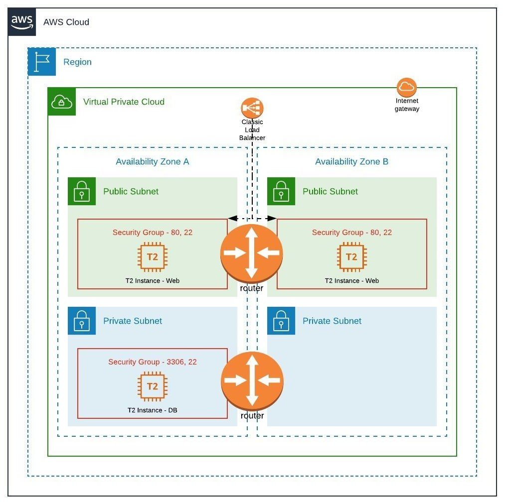

# What is this repository for?

This repository will help you install [Mediawiki](https://www.mediawiki.org) on AWS in fully automated fashion using Terraforma, AWS cli and Ansible.

Terraform is responsible for provisioning infrastructure on AWS while Ansible helps install Mediawiki.

## Diagrams - Infra


## Diagram - Execution
1. Traffic arrives on load balancer and get routed to web servers in public subnet
2. Web servers can only make calls to DB server in private subnet

## Useful links
1. Media Wiki installation steps [link](https://www.mediawiki.org/wiki/Manual:Running_MediaWiki_on_Debian_or_Ubuntu)
2. Enabling keyless authentication [link](https://www.digitalocean.com/community/tutorials/how-to-configure-ssh-key-based-authentication-on-a-linux-server)
3. Enabling passwordless sudo [link](https://code-maven.com/enable-ansible-passwordless-sudo)

## How to Execute Terrform Scripts

## Preparing Master Machine
Please refer to file - [master-setup-script.sh](master-setup-script.sh)
```
chmod 700 master-setup-script.sh
./master-setup-script.sh
```

### Plan
```
terrform plan
```

### Apply
```
terraform apply
```

### Destroy
```
terraform destroy
```

## How to Execute Ansible Playbook independent of Terraform
```
ansible-playbook -i non-production master-install-mediawiki.yaml
```

## Logs
1. terraform plan [Logs](static/terraform-plan.log)
2. terraform apply [Logs](static/terraform-apply.log)
3. terraform destroy [Logs](static/terraform-destroy.log)
4. Ansible [Logs](static/ansible.log)

## How to Secure Passwords
1. Open /etc/ansible/ansible.cfg
2. Update setting "vault_password_file" to point to a file where vault password is stored
3. [Reference](https://www.digitalocean.com/community/tutorials/how-to-use-vault-to-protect-sensitive-ansible-data-on-ubuntu-16-04)

## Things to consider
1. Check python version of destination machines. If version <= 3 then please comment "ansible_python_interpreter" in group_vars
2. Check if destination machine does not prompt during package upgrade. In my case grub prompt halted my ansible execution.
3. Pre-bake your image and provide ami-id in terraform.tfvars

For any questions, please write to me at visharad.dhavle[at].gmail.com
